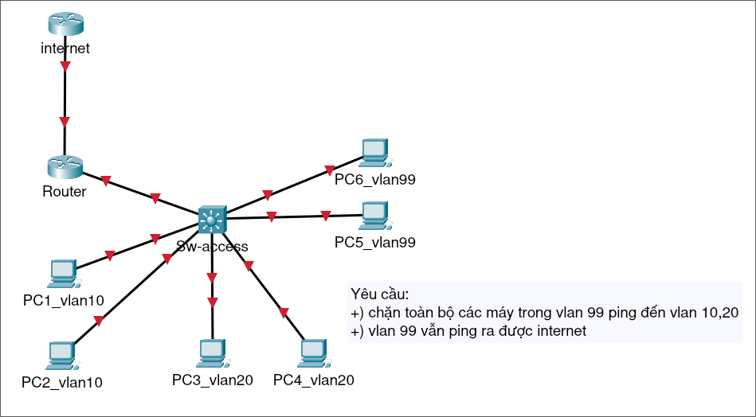

# Đề bài:



### Các thiết bị và cổng kết nối:
- 6 chiếc PC
- 2 cái Router (1 cái làm internet)
- 1 cái Switch 3650-24PS

### Các bước thực hiện:
1.Cấu hình Switch:
```
Switch>en
Switch#conf t
Switch(config)#vlan 10
Switch(config-vlan)#name vlan10
Switch(config-vlan)#ex
Switch(config)#vlan 20
Switch(config-vlan)#name vlan20
Switch(config-vlan)#ex
Switch(config)#vlan 99
Switch(config-vlan)#name vlan99
Switch(config-vlan)#ex

Switch(config)#int range gi1/0/15-22
Switch(config-if-range)#switchport mode access 
Switch(config-if-range)#switchport access vlan 10
Switch(config-if-range)#ex
Switch(config)#int range gi1/0/7-14
Switch(config-if-range)#switchport mode access 
Switch(config-if-range)#switchport access vlan 20
Switch(config-if-range)#ex
Switch(config)#int range gi1/0/2-6
Switch(config-if-range)#switchport mode access 
Switch(config-if-range)#switchport access vlan 99
Switch(config-if-range)#ex

Switch(config)#int vlan 10
Switch(config-if)#ip address 10.0.10.1 255.255.255.0
Switch(config-if)#no shutdown 
Switch(config-if)#ex

Switch(config)#int vlan 20
Switch(config-if)#ip address 10.0.20.1 255.255.255.0
Switch(config-if)#no shutdown 
Switch(config-if)#ex

Switch(config)#int vlan 99
Switch(config-if)#ip address 10.0.99.1 255.255.255.0
Switch(config-if)#no shutdown 
Switch(config-if)#ex

Switch(config)#int gi1/0/1
Switch(config-if)#switchport mode trunk
Switch(config-if)#switchport trunk allowed vlan 10,20,99
Switch(config-if)#ex

Switch(config)#ip route 0.0.0.0 0.0.0.0 10.0.99.254 (ip mặc định ra router)
Switch(config)#ip routing
```

2.Cấu hình Router:
```
Router>en
Router#conf t
Router(config)#int fa0/1.10
Router(config-subif)#encapsulation dot1Q 10
Router(config-subif)#ip address 10.0.10.254 255.255.255.0
Router(config-subif)#ex

Router(config)#int fa0/1.20
Router(config-subif)#encapsulation dot1Q 20
Router(config-subif)#ip address 10.0.20.254 255.255.255.0
Router(config-subif)#ex

Router(config)#int fa0/1.99
Router(config-subif)#en
Router(config-subif)#encapsulation dot1Q 99
Router(config-subif)#ip address 10.0.99.254 255.255.255.0
Router(config-subif)#ex

Router(config)#int fa0/0
Router(config-if)#ip address 203.0.113.2 255.255.255.0
Router(config-if)#no shutdown 

Router(config)#int fa0/1
Router(config-if)#no shutdown 

Router(config-if)#ex
Router(config)#ip route 0.0.0.0 0.0.0.0 203.0.113.1
Router(config)#access-list 1 permit 10.0.0.0 0.0.255.255
Router(config)#ip nat inside source list 1 interface fa0/0 overload 

Router(config)#int fa0/0
Router(config-if)#ip nat outside 
Router(config-if)#ex

Router(config)#int fa0/1
Router(config-if)#ip nat inside 
Router(config-if)#ex
```

3.Cấu hình internet:
```
Router>en
Router#conf t
Router(config)#int fa0/0
Router(config-if)#ip address 203.0.113.1 255.255.255.0
Router(config-if)#no shutdown 
Router(config-if)#ex

Router(config)#int loopback0
Router(config-if)#ip address 8.8.8.8 255.255.255.255
Router(config-if)#ex

Router(config)#ip route 10.0.0.0 255.255.0.0 203.0.113.2
```


4.Chặn vlan 99 ping đến các vlan khác:
```
Switch>
Switch>en
Switch#conf t
Switch(config)#ip access-list extended BLOCK_VLAN99
Switch(config-ext-nacl)#deny ip 10.0.99.0 0.0.0.255 10.0.20.0 0.0.0.255
Switch(config-ext-nacl)#deny ip 10.0.99.0 0.0.0.255 10.0.10.0 0.0.0.255
Switch(config-ext-nacl)#permit ip 10.0.99.0 0.0.0.255 any
Switch(config-ext-nacl)#ex

Switch(config)#int vlan 99
Switch(config-if)#ip access-group BLOCK_VLAN99 in
Switch(config-if)#ex
```
