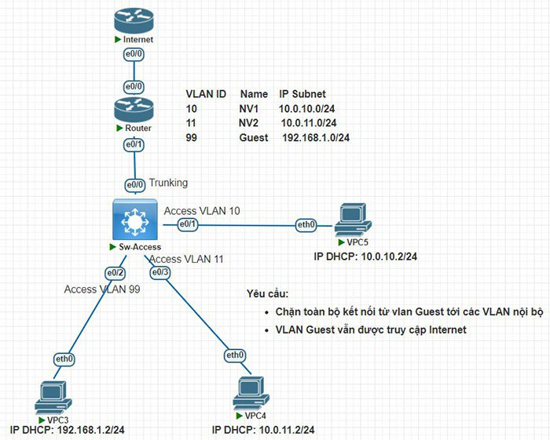

# Các bước config bài lab

## Đề bài:


### Các thiết bị sử dụng:
- 6 chiếc PC
- 1 Switch 3650-24PS
- 2 Router (1 cái mô phỏng internet)

### Các bước cấu hình:

Tạo vlan và chia các cổng Switch ra làm 3 vlan là 10, 20, 99
- Các PC này đều thuộc subnet mask 255.255.255.0

```


